## App Online

```shell
https://todo-fredvel.up.railway.app/
```

## Project Views

Home page

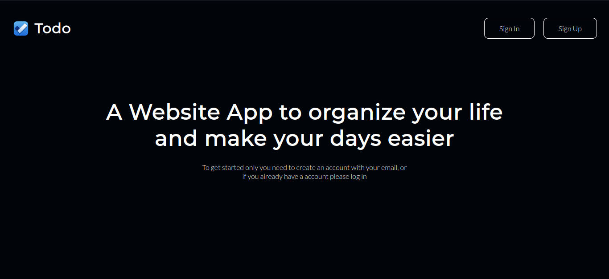

Sign In

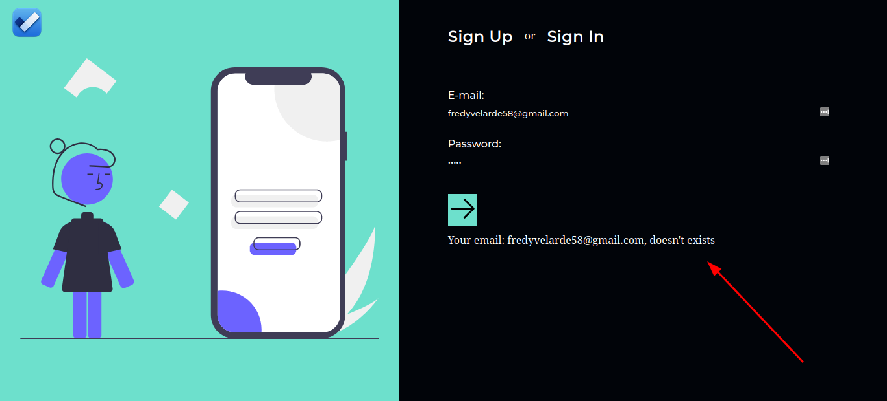

Sign Up

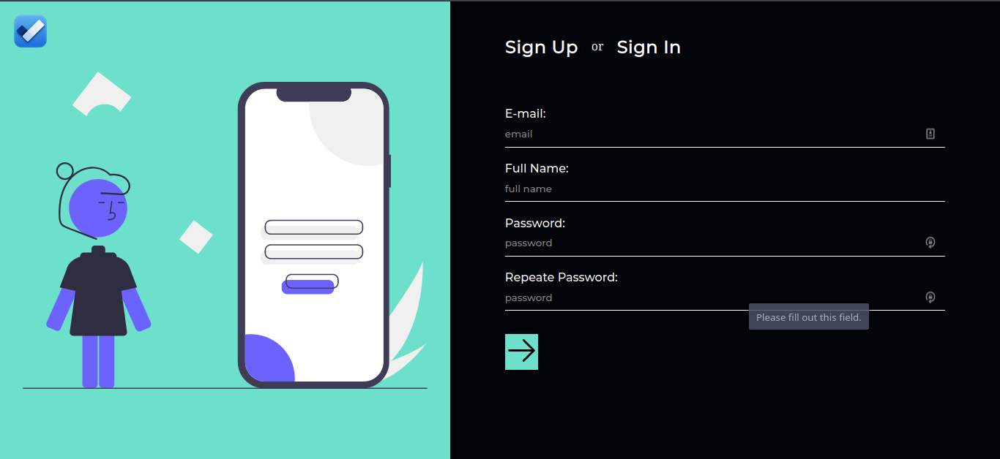

Dashboard - Settings account

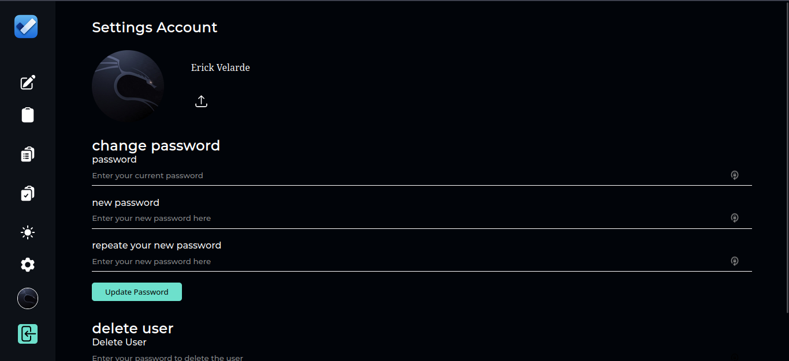

Create Tasks

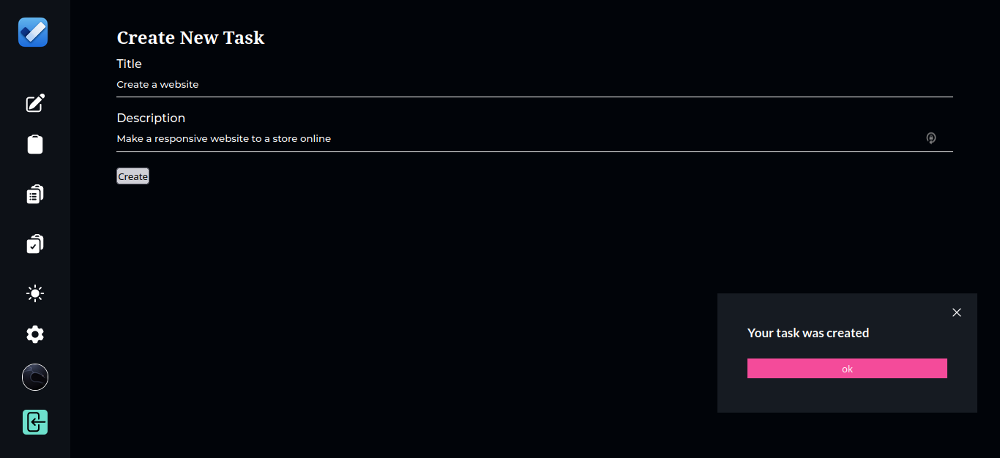

All Tasks

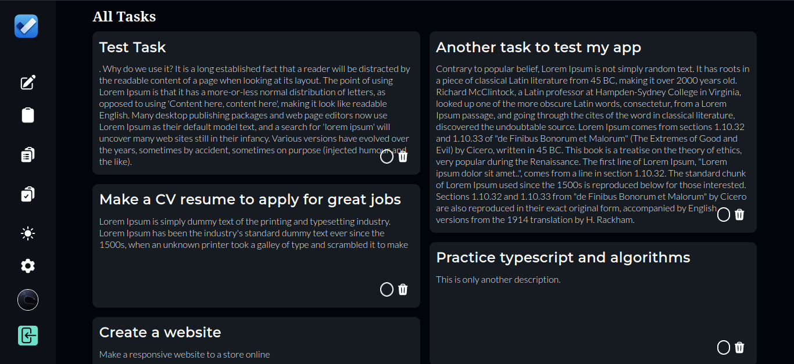

Log out

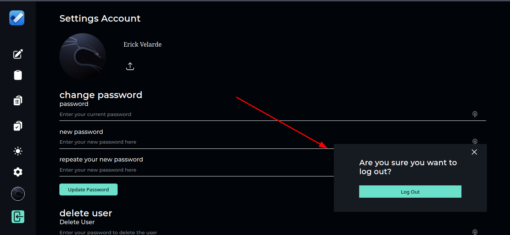

Light Theme

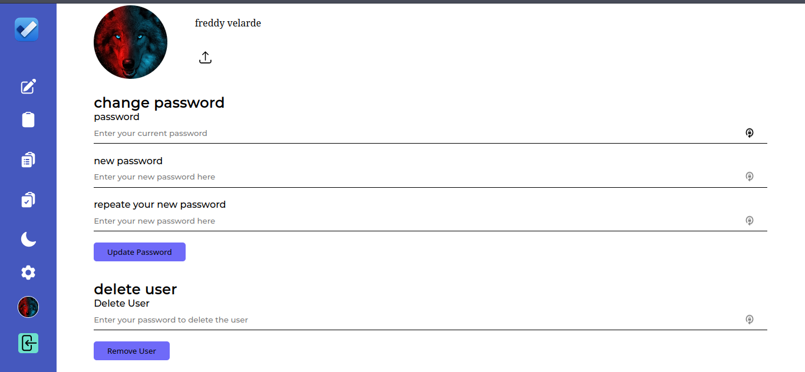

Responsive/phone views

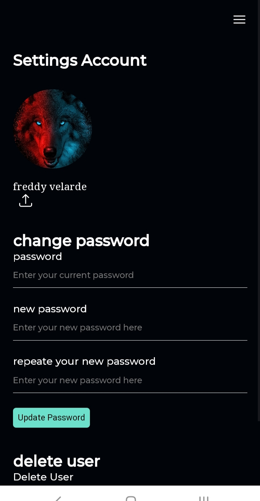

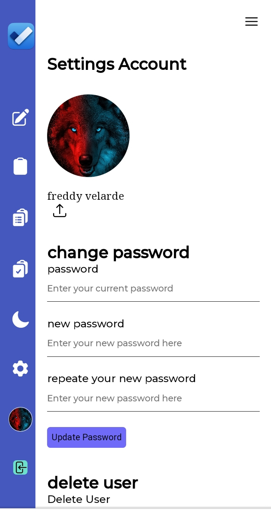

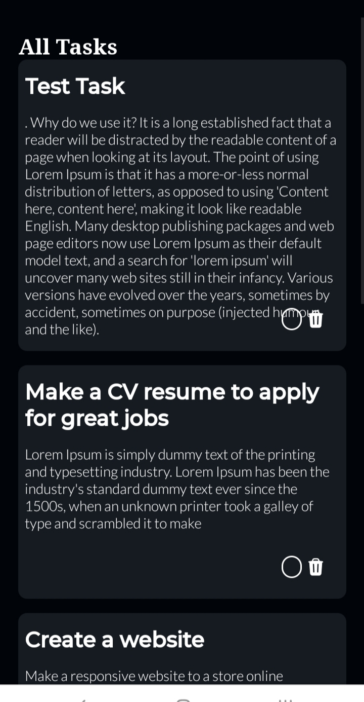

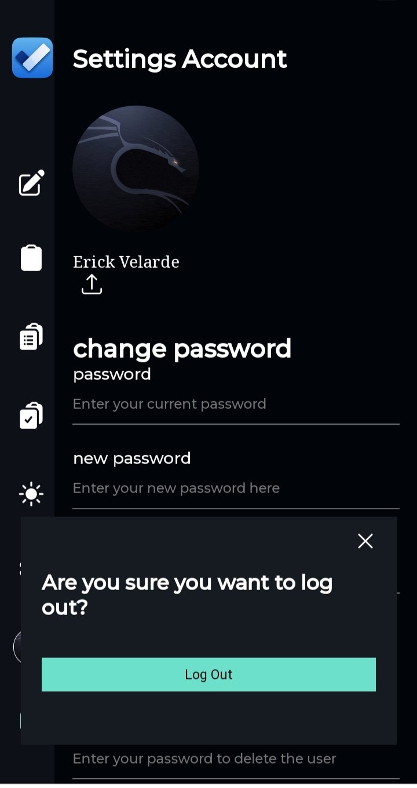

## Start project:

To Run the project just clone the project

```shell
git clone https://github.com/Fredvel123/todo-list
```

If you want to install the whole project you can execute the install.sh file

```shell
./install.sh
```

But If it doesen't work you can install the project manually.

## Technologies

- ReactJs
- ExpressJs/typescript
- Database/postgresql

## Deploy

- Client - frontend was deployed in Netlify https://railway.app
- Server Backend was deployed in Heroku https://railway.app
- Database was deployed in Clever Cloud platform https://www.clever-cloud.com/
- Images was uploaded to Cloudinary cloud https://cloudinary.com/
