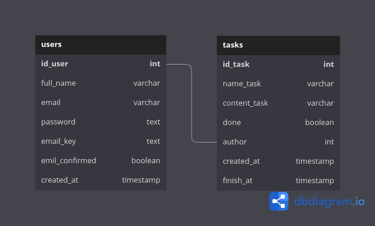

# Todo List Backend Express/Typescript

## Data Base Diagram

</img>

## REST API

AUTHENTICATION:

- url/api/auth/signup

```js
headers: {
  "Method": "POST",
  "Content-type": "multipart/form-data"
}
body: {
  full_name: "user name",
  email: "user email",
  password: "user password"
  avatar: // user avaatar image
}
```

- url/api/auth/signin

```js
headers: {
  "Method": "POST",
  "Content-Type": "application/json"
}
body: {
  email: "user email",
  password: "user password"
}
```

- url/api/auth/lostpsswd/[email_user] GET
<!-- - url/api/auth/email/:id GET -->

USERS:

- url/api/users/all
- url/api/users/editpasswd POST

```js
headers: {
  "access-token": "token string",
  "Method": "POST",
  "Content-Type": "application/json"
}
body: {
  password: "user password"
  new_password: "new password"
  repeate_new_password: "repeate new password"
}
```

- url/api/users/user GET

```js
headers: {
  "access-token": "token string",
  "Method": "GET",
}
```

- url/api/users/delete DELETE

```js
headers: {
  "access-token": "token string",
  "Method": "DELETE",
}
```

TASKS:

- url/api/tasks/all
- url/api/tasks/create

```js
headers: {
  "Content-type": "application/json",
  "access-token: "your token",
  "METHOD": "POST"
},
body: {
  title: "title task",
  description: "description task",
  date: "valid date to finish task"
}
```

- url/api/tasks/user

```js
headers: {
  "Content-type": "application/json",
  "access-token: "your token",
  "METHOD": "GET"
}
```

- url/api/tasks/edit/id_task

```js
headers: {
  "Content-type": "application/json",
  "access-token: "your token",
  "METHOD": "PATCH"
},
body: {
  title: "title task",
  description: "description task",
  state: true | false // done task
}
```

- url/api/tasks/remove/id_task

```js
headers: {
  // "Content-type": "application/json",
  // "access-token: "your token",
  "METHOD": "DELETE"
}
```

## Dependences and Libraries

- Express - **Main Library**
- Dotenv
- JWT
- Bcryptjs
- sequelize
- morgan
- cloudinary
- Multer
